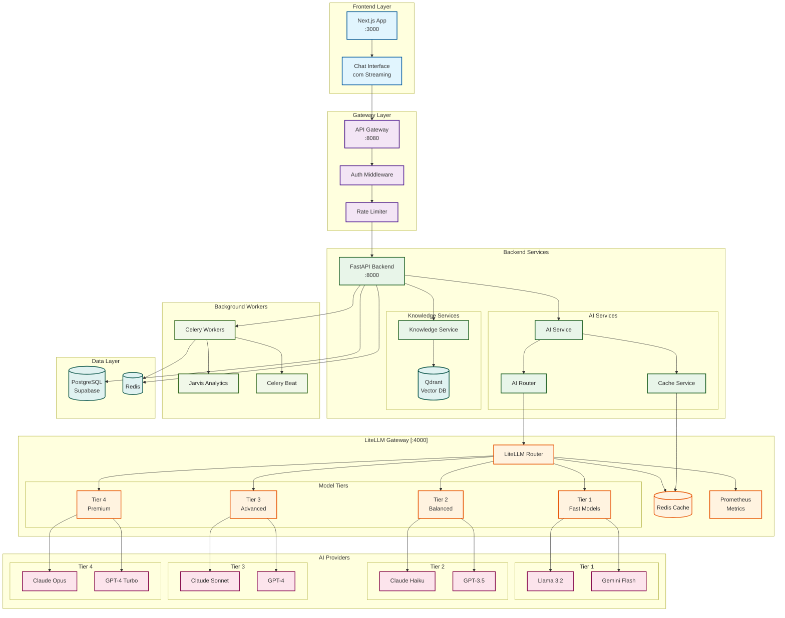
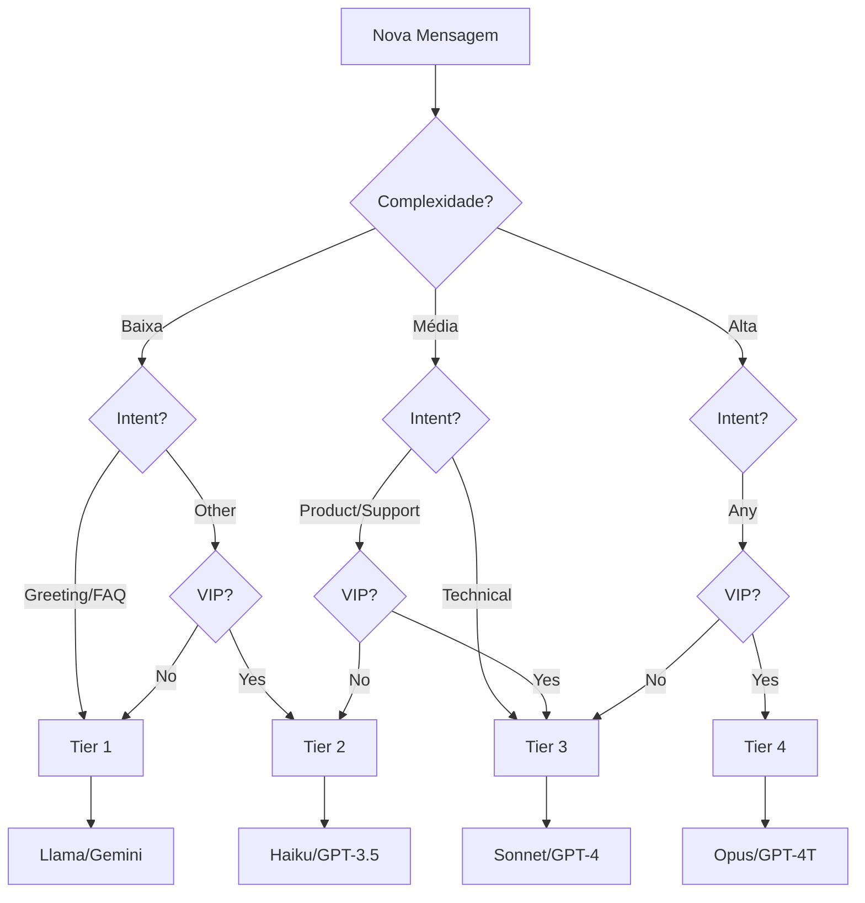
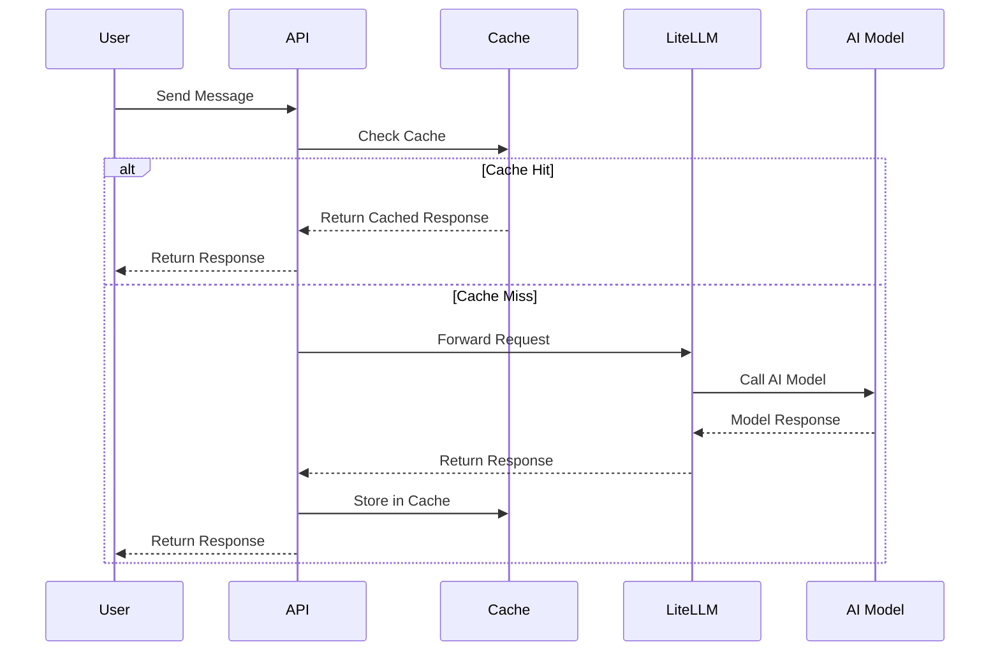

# 🏗️ Arquitetura LiteLLM - Agentes de Conversão



## 🔄 Fluxo de Dados

### 1. **Requisição de Chat**
```
User → Frontend → Gateway → Backend → AI Router → LiteLLM → AI Provider
```

### 2. **Roteamento Inteligente**
```
Message → Complexity Analysis → Intent Detection → User Value Check → Tier Selection
```

### 3. **Fallback Chain**
```
Primary Model → Fallback 1 → Fallback 2 → Default Response
```

### 4. **Cache Flow**
```
Request → Check Cache → Hit? Return : Process → Store in Cache → Return
```

## 📊 Decisão de Roteamento



## 💾 Cache Strategy



## 🎯 Key Features

### Intelligent Routing
- **Complexity Analysis**: Word count, technical terms, code detection
- **Intent Classification**: Greeting, FAQ, support, sales, technical
- **User Segmentation**: Standard, VIP, Enterprise
- **Cost Optimization**: Route to cheapest capable model

### Reliability
- **Automatic Fallback**: Seamless failover between models
- **Circuit Breaker**: Prevent cascade failures
- **Health Checks**: Continuous monitoring
- **Request Retry**: With exponential backoff

### Performance
- **Response Caching**: TTL-based caching
- **Connection Pooling**: Reuse HTTP connections
- **Async Processing**: Non-blocking operations
- **Stream Support**: Real-time responses

### Observability
- **Prometheus Metrics**: Request count, latency, tokens, cost
- **Structured Logging**: JSON logs with context
- **Distributed Tracing**: Request flow tracking
- **Cost Analytics**: Real-time spend monitoring

## 🚀 Deployment Ready

The implementation is production-ready with:
- ✅ Docker containerization
- ✅ Environment-based configuration
- ✅ Horizontal scaling support
- ✅ Security best practices
- ✅ Comprehensive monitoring
- ✅ Automated testing
- ✅ CI/CD integration
- ✅ Documentation
