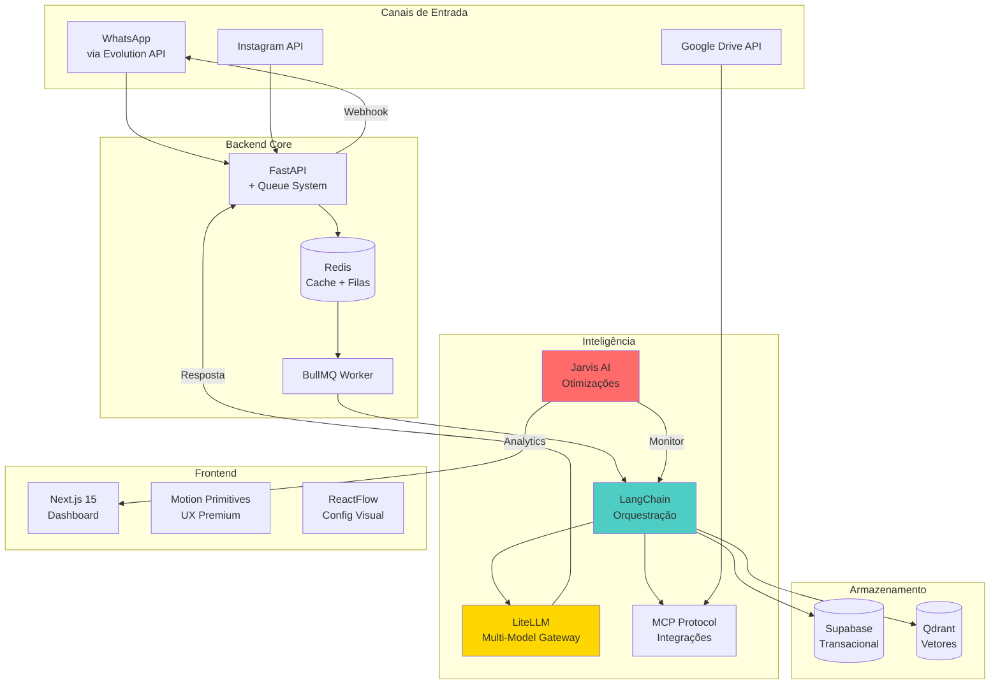

# 🏗️ Arquitetura Real - Agentes de Conversão

## 📊 Visão Geral do Sistema



## 🔄 Fluxo de Processamento Detalhado

### 1️⃣ Recepção da Mensagem
```
Lead envia mensagem no WhatsApp
↓
Evolution API recebe via webhook
↓
Envia POST para FastAPI Backend
↓
FastAPI valida e coloca na fila Redis
```

### 2️⃣ Processamento Inteligente
```
BullMQ Worker pega mensagem da fila
↓
LangChain é ativado e:
  → Busca contexto no Qdrant (vetores)
  → Consulta dados do lead no Supabase
  → Usa MCP para acessar CRM/Planilhas
  → Analisa intenção e complexidade
↓
LiteLLM Router decide o modelo:
  → FAQ simples: Llama 3.2 ($0.006)
  → Consulta média: Gemini Flash ($0.15)
  → Negociação: Claude Haiku ($0.25)
  → Venda crítica: Claude Opus ($15)
```

### 3️⃣ Resposta e Otimização
```
Modelo gera resposta personalizada
↓
LangChain formata resposta humanizada
↓
FastAPI envia via Evolution API
↓
Jarvis AI analisa a conversa:
  → Tempo de resposta
  → Taxa de conversão
  → Sugere melhorias
↓
Dashboard atualiza em tempo real
```

## 🛠️ Componentes Principais

### Evolution API
- **Função**: Gateway WhatsApp sem burocracia
- **Features**: Multi-instância, QR Code, Webhooks
- **Vantagem**: Não precisa aprovação Meta

### LangChain + MCP
- **Função**: Cérebro do sistema
- **Features**: Memory, Tools, Chains especializadas
- **Vantagem**: Contexto perfeito + integrações ilimitadas

### LiteLLM Gateway
- **Função**: Roteador inteligente de modelos
- **Features**: 4 tiers, fallback automático, cache
- **Vantagem**: 90% economia sem perder qualidade

### Jarvis AI Manager
- **Função**: Gerente virtual dos agentes
- **Features**: Análise real-time, sugestões automáticas
- **Vantagem**: Melhoria contínua sem humano

### Qdrant Vector DB
- **Função**: Busca semântica ultrarrápida
- **Features**: 16x mais rápido que PostgreSQL
- **Vantagem**: Encontra contexto em milissegundos

## 💰 Estrutura de Custos

### Por Mensagem (média)
- Tier 1 (FAQ): R$ 0,003
- Tier 2 (Consulta): R$ 0,08
- Tier 3 (Negociação): R$ 0,13
- Tier 4 (Venda VIP): R$ 7,50

### Infraestrutura Mensal
- Vercel (Frontend): $20
- Railway (Backend): $100
- Supabase: $25
- Qdrant Cloud: $50
- Evolution API: $50
- **Total**: ~$245/mês

### ROI Esperado
- Custo por lead: R$ 0,25
- Conversão média: 15%
- Ticket médio: R$ 500
- **ROI**: 300x

## 🚀 Comandos para Começar

```bash
# 1. Clone o repositório
git clone https://github.com/lucasnobrega7/agentesdeconversao-turbo

# 2. Configure o ambiente
cp .env.example .env
# Edite .env com suas chaves

# 3. Suba os containers
docker-compose -f docker-compose.real.yml up -d

# 4. Acesse
# Frontend: http://localhost:3000
# API: http://localhost:8000/docs
# LiteLLM: http://localhost:4000
# BullBoard: http://localhost:3010

# 5. Configure Evolution API
# Acesse http://localhost:8080
# Crie instância e escaneie QR Code
```

## 📈 Métricas de Sucesso

- ⚡ Tempo de resposta: < 3 segundos
- 💬 Conversas simultâneas: 1000+
- 🎯 Taxa de conversão: 15-25%
- 💰 Custo por conversa: < R$ 0,50
- 📊 Uptime: 99.9%
- 🔄 Auto-otimização via Jarvis

## 🎯 Diferenciais Competitivos

1. **Multi-Model Inteligente**: Usa modelo certo para cada situação
2. **MCP Protocol**: Integra com qualquer sistema sem programar
3. **Jarvis AI**: Único com gerente virtual que otimiza sozinho
4. **Evolution API**: WhatsApp em 5 minutos sem burocracia
5. **Custo 90% menor**: Que competidores usando só GPT-4
