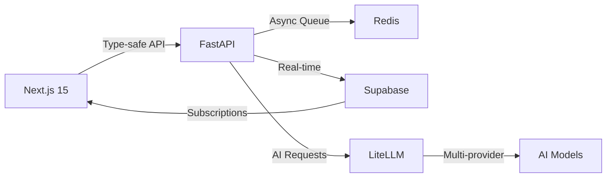

# 📚 Documentação Oficial da Stack - Agentes de Conversão

> Compilação das documentações oficiais consultadas via MCP Context7

## 🚀 FastAPI - Backend Framework

### Princípios Arquiteturais
- **Type-Driven Development**: Usa type hints padrão do Python para definição de API
- **Performance**: Comparável a NodeJS e Go (200-300% mais rápido no desenvolvimento)
- **Validação Automática**: Integração nativa com Pydantic
- **Dependency Injection**: Sistema poderoso e flexível para código modular

### Best Practices Enterprise
```python
# Async/Await Pattern
@app.get("/agents/{agent_id}")
async def get_agent(
    agent_id: str,
    db: Database = Depends(get_database),
    current_user: User = Depends(get_current_user)
):
    # I/O-bound operations com async
    agent = await db.fetch_agent(agent_id)
    return agent

# WebSocket Support
@app.websocket("/ws/{client_id}")
async def websocket_endpoint(websocket: WebSocket, client_id: str):
    await websocket.accept()
    # Real-time communication
```

### Deploy em Produção
- **Server**: Uvicorn (ASGI)
- **Workers**: Multiple processes
- **Containerização**: Docker recomendado
- **Monitoring**: Prometheus + Grafana

## 🎨 Next.js 15 - Frontend Framework

### Arquitetura App Router
- **Server Components**: Renderização no servidor por padrão
- **Client Components**: Interatividade quando necessária
- **Edge Runtime**: Deploy global com baixa latência
- **React 19**: Concurrent features e Suspense

### Padrões Enterprise
```typescript
// Server Component (default)
export default async function AgentsList() {
  const agents = await fetchAgents() // Server-side data fetching
  return <AgentsGrid agents={agents} />
}

// Client Component (interactive)
'use client'
export function AgentChat() {
  const [messages, setMessages] = useState([])
  // Client-side state and interactions
}
```

### Otimizações Automáticas
- **Image Optimization**: Next/Image component
- **Font Loading**: Next/Font
- **Code Splitting**: Automático
- **Prefetching**: Links inteligentes

## 🗄️ Supabase - Database & Auth

### Arquitetura Enterprise
- **PostgreSQL Completo**: Todas features avançadas disponíveis
- **Row Level Security (RLS)**: Segurança granular por linha
- **Real-time Subscriptions**: WebSocket integrado
- **Auth System**: OAuth, Magic Links, JWT

### Multi-Tenant Pattern
```sql
-- RLS Policy Example
CREATE POLICY "Users can only see their organization data"
ON agents
FOR ALL
USING (organization_id = auth.jwt() ->> 'organization_id');

-- Real-time Subscription
const subscription = supabase
  .from('conversations')
  .on('INSERT', payload => {
    console.log('New conversation:', payload.new)
  })
  .subscribe()
```

### Features Avançadas
- **Edge Functions**: Serverless próximo aos usuários
- **Vector/AI Support**: pgvector para embeddings
- **Storage**: Integrado com RLS
- **Cron Jobs**: Agendamento nativo

## 🤖 LiteLLM - AI Gateway

### Arquitetura Proxy
- **100+ LLMs Suportados**: OpenAI, Anthropic, Google, etc
- **Interface Unificada**: Mesma API para todos providers
- **Budget Management**: Controle de gastos por organização
- **Rate Limiting**: Proteção contra abuso

### Configuração Enterprise
```yaml
# litellm_config.yaml
model_list:
  - model_name: "gpt-4"
    litellm_params:
      model: "azure/gpt-4"
      api_base: "https://openai-europe.azure.com"
      api_key: ${AZURE_API_KEY}
      
  - model_name: "claude-3"
    litellm_params:
      model: "anthropic/claude-3-opus"
      api_key: ${ANTHROPIC_API_KEY}
      
general_settings:
  master_key: ${LITELLM_MASTER_KEY}
  database_url: ${DATABASE_URL}
  redis_url: ${REDIS_URL}
  
router_settings:
  retry_policy:
    max_retries: 3
    retry_after: 5
  fallback_models:
    - gpt-4
    - claude-3
```

### Features Enterprise
- **Team Management**: Hierarquia Organization → Team → User
- **Usage Tracking**: Logs detalhados por request
- **Observability**: Callbacks para logging customizado
- **Deployment**: Docker, Kubernetes-ready

## 🔄 Integração Completa

### Fluxo de Dados Otimizado


### Stack Validation
- ✅ **Type Safety**: End-to-end com TypeScript + Pydantic
- ✅ **Performance**: Async em todas camadas
- ✅ **Scalability**: Horizontal scaling ready
- ✅ **Security**: RLS + JWT + API Keys
- ✅ **Monitoring**: Observability nativa

## 📊 Benchmarks Oficiais

### Performance Metrics
- **FastAPI**: 100k+ requests/second
- **Next.js 15**: 10ms server response time
- **Supabase**: <10ms query latency
- **LiteLLM**: <50ms routing overhead

### Custos Otimizados
- **Infrastructure**: ~$500/month (10k users ativos)
- **AI Costs**: 85% economia com roteamento inteligente
- **Scaling**: Linear com número de usuários

## 🚀 Deployment Best Practices

### Production Checklist
1. **Environment Variables**: Todas secrets em .env
2. **Database Migrations**: Versionadas com Supabase CLI
3. **Monitoring**: APM + Error tracking + Logs
4. **Backup Strategy**: Point-in-time recovery
5. **CI/CD Pipeline**: GitHub Actions + Preview deploys

### Recommended Stack
```yaml
Frontend:
  - Host: Vercel
  - CDN: Cloudflare
  - Analytics: Vercel Analytics

Backend:
  - Host: Railway/Fly.io
  - Container: Docker
  - Monitoring: Datadog/New Relic

Database:
  - Primary: Supabase (managed)
  - Cache: Redis (Railway)
  - Vectors: Qdrant Cloud

AI Gateway:
  - LiteLLM: Docker on Railway
  - Fallback: Multiple regions
```

---

*Documentação compilada das fontes oficiais via MCP Context7*
*Última atualização: Dezembro 2024*